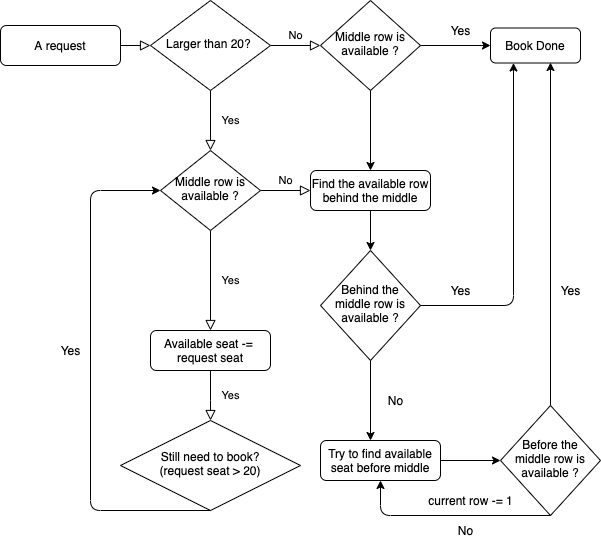
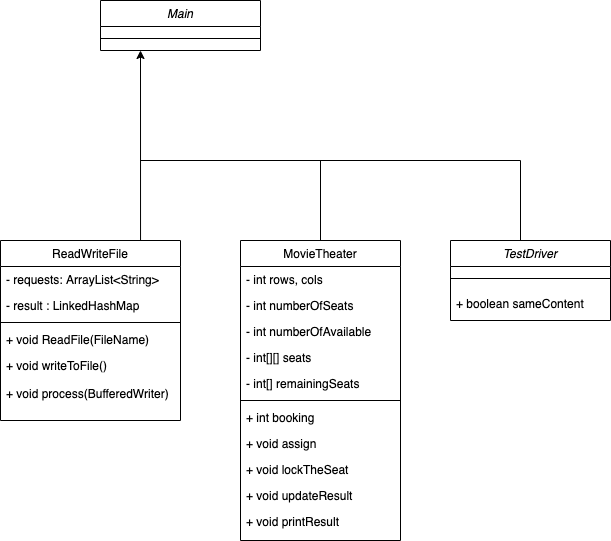

# Design a movie ticket booking system
## Description

We need to design an online Movie ticket booking system where a user can search a movie in a given city and book it.This article will explain you the architecture of the booking system.

1. Input.txt:

Each line in the file will be comprised of a reservation identifier, followed by a space, and then the number of seats requested. The reservation identifier will have the format: R####.

e.g.

R001 2:First request, booking 2 seats

2. Output.txt:

Each row in the file should include the reservation number followed by a space, and then a comma-delimited list of the assigned seats.

e.g.

R001 I1,I2: Assign the people at the row of I and column of 1, 2.

## Analyze
Principle: first in first satisfy
1.  Public Safety 
    1. Assume that a buffer of three seats and/or one row

2. Customer Satisfaction
    1. For each request, assign the customers to seat together as possible.
    2. For viewing experience, assign the customers as behind as we can.
    
3. Maximum Utilization
    1. If the booking seats is not over 20 of each request, we assign consecutive seats as we can. As the rule2, we should first assign customer at the middle
    of each row for the best viewing experience.
       
    2. If the booking seats is over 20 of each request, we assign customers to fill a whole row at first,
    then try to find if there are available seats for the other customers, but to ensure they are close to their friends and family.
       

## Algorithm
1. For each request, assgin the customers at the middle of theater as we can.
   
    1. If the number of customers is smaller than 20, assign the customers in the same row.
   Else, assgin customer to fill the current row and then try to find available seats behind this row; if behind the current row is not available, try
   to find the available seats before the current row.
   
2. For the next request, checking each row behind the middle row, try to find available seats for our customers.
    1. If we cannot find enough available seats behind the middle, try to find before the middle row.

## Assumption
1. If a request seat is larger than the current available seat/ or larger than the maximum theater capacity,
simply reject this request. (Sorry)
   
2. For empty request just output empty result.

3. Family should seat together! No buffer, No barriers! 

4. A seat mark with 9 means is the public safety buffer. (Due to COVID-19 so mark 9 :)  
